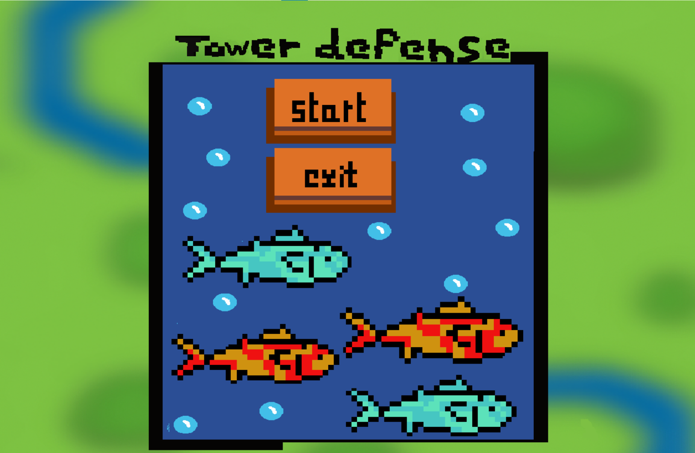

# Tower Defense Game

A Tower Defense game where the goal is to defend your base from enemy attacks.
This game is built using Python and the Pygame library. It features a variety of towers, enemies, and a simple yet engaging gameplay loop.

## Features
- **Towers**: Place different types of towers to defend against waves of enemies.
- **Enemies**: Various types of enemies with different attributes.
- **Waves**: Enemies come in waves, increasing in difficulty.
- **Resources**: Collect resources to build and upgrade towers.
- **User Interface**: A simple and intuitive UI to manage your towers and resources.
- **Sound Effects**: Enjoy sound effects for actions like placing towers and defeating enemies.
- **Mouse and Keyboard Controls**: Play the game using both mouse clicks and keyboard shortcuts.




## Installation
To run this game, you need to have Python installed on your machine. You can download it from [python.org](https://www.python.org/downloads/).
After installing Python, you need to install the Pygame library. You can do this using pip. Open your terminal or command prompt and run the following command:

```bash
pip install pygame
```

After the installation is complete, simply run the main file from your terminal:

```
python main.py
```

## How to Play

In this game, you will place towers to defend your base from incoming waves of enemies. You can build different types of towers, each with unique abilities and costs. As you defeat enemies, you will earn resources that can be used to build and upgrade your towers.


## Game controls
Use the buttons on the sidebar to perform actions.

### Mouse Controls
- **Left Click**: Place a tower at the clicked position.


### Keyboard Shortcuts

Use the following keys for quick access:

- Press **'B'** to enter **Buy** mode.
- Press **'D'** to enter **Delete** mode.
- **'Esc'**: Exit the game.
- **'R'**: Reset the game.